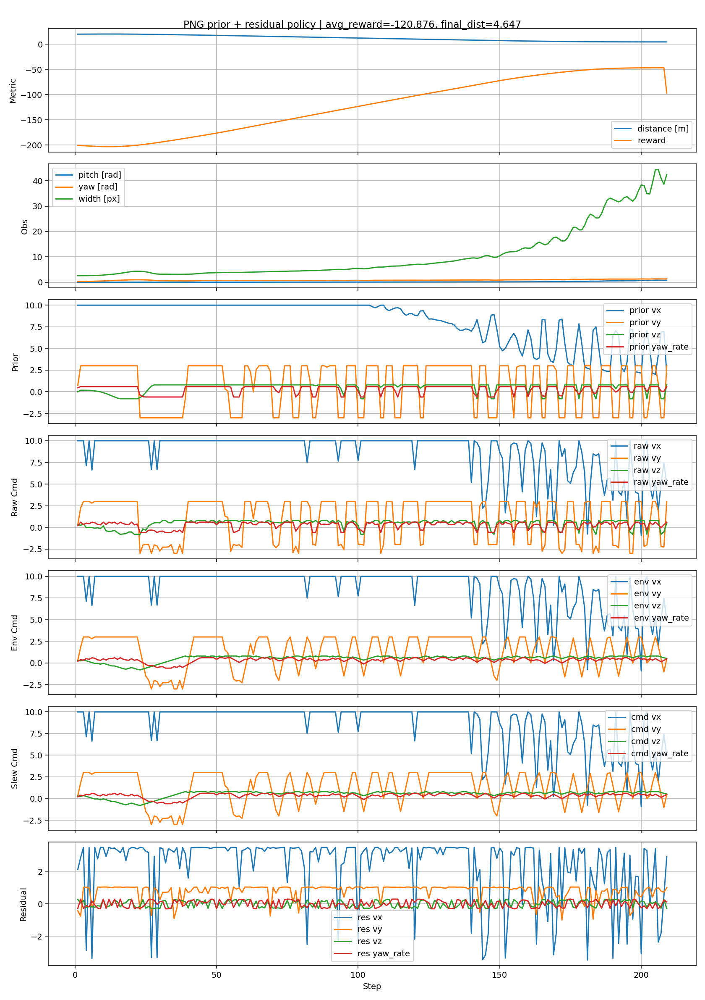

# Physics-Guided Residual Interception

This repository contains pretrained policies and runnable demonstrations for
physics-guided residual learning in onboard visual-servoing-based drone
interception.

The controller combines a proportional navigation guidance (PNG) prior with a
learned horizontal residual command. Target altitude is controlled by a PD
controller in the released demonstrations.

## Released Models

| Model | Observation | Architecture | Policy output |
|---|---|---|---|
| v38 | LOS pitch, LOS yaw, target width, pitch rate, yaw rate | MLP | residual lateral velocity |
| v47 | LOS pitch, LOS yaw, target width, pitch rate, yaw rate | LSTM | residual lateral velocity |
| v48 | LOS pitch, LOS yaw, target width | MLP | residual lateral velocity |
| v49 | LOS pitch, LOS yaw, target width | LSTM | residual lateral velocity |

The checkpoint files are stored in `checkpoints/`. All four policies use a
nominal forward speed of `12 m/s`, a target speed of `7 m/s`, a maximum lateral
speed of `8 m/s`, and a maximum vertical speed of `3 m/s`.

## Repository Layout

```text
.
├── checkpoints/
│   ├── v38_5d_mlp.pth
│   ├── v47_5d_lstm.pth
│   ├── v48_3d_mlp.pth
│   └── v49_3d_lstm.pth
├── demo/
│   ├── demo_png_vy_vz_residual.py
│   ├── demo_png_vy_lstm_pd_height.py
│   ├── demo_runtime.py
│   ├── run_demo.sh
│   └── representative_interception.png
└── src/
    └── aerial_gym_simulator/
```

## Installation

The demonstration requires Linux, an NVIDIA GPU, NVIDIA Isaac Gym Preview 4,
and the `aerialgym` conda environment used by Aerial Gym Simulator.

Clone the repository together with the simulator submodule:

```bash
git clone --recurse-submodules \
  https://github.com/FDUHl/Physics-Guided-Residual-Interception.git

cd Physics-Guided-Residual-Interception
```

If the repository was cloned without submodules, initialize it with:

```bash
git submodule update --init --recursive
```

Activate the environment and install the bundled simulator:

```bash
conda activate aerialgym
pip install -e src/aerial_gym_simulator
```

Isaac Gym itself must be installed separately according to its license and
installation instructions. Verify that the Isaac Gym examples run before
starting the interception demo.

## Run A Demo

Run one of the four policies with the Isaac Gym viewer:

```bash
bash demo/run_demo.sh v38 viewer
bash demo/run_demo.sh v47 viewer
bash demo/run_demo.sh v48 viewer
bash demo/run_demo.sh v49 viewer
```

Run without a viewer:

```bash
bash demo/run_demo.sh v38 headless
```

The default demonstration uses:

```text
horizontal angle:       10 deg
vertical angle:         10 deg
horizontal distance:    30 m
UAV altitude:           60 m
forward speed:          12 m/s
height PD:              Kp=5.5, Kd=0.55
vertical speed limit:   3 m/s
```

Plots and rollout logs are written to `demo_outputs/`.

## Change The Scenario

Additional arguments are forwarded to the Python demo. For example, run v47
with a horizontal angle of `-15 deg` and no initial vertical angle:

```bash
bash demo/run_demo.sh v47 viewer \
  --target-rear-bearing-deg -15 \
  --init-target-pitch-deg 0
```

Run a larger-angle v49 scenario:

```bash
bash demo/run_demo.sh v49 viewer \
  --target-rear-bearing-deg 20 \
  --init-target-pitch-deg 10
```

To change the height controller:

```bash
bash demo/run_demo.sh v38 viewer \
  --hold-kp 5.5 \
  --hold-kd 0.35 \
  --hold-max-vz 3
```

Close the Isaac Gym viewer or press `ESC` to exit.

## Demonstration Output

The following representative rollout shows distance, visual observations, PNG
prior commands, executed commands, and residual policy outputs:



## Simulator Attribution

The simulation backend is based on
[Aerial Gym Simulator](https://github.com/ntnu-arl/aerial_gym_simulator) by
NTNU ARL. The bundled submodule points to a task-level extension used for the
visual tracking and interception demonstrations.
